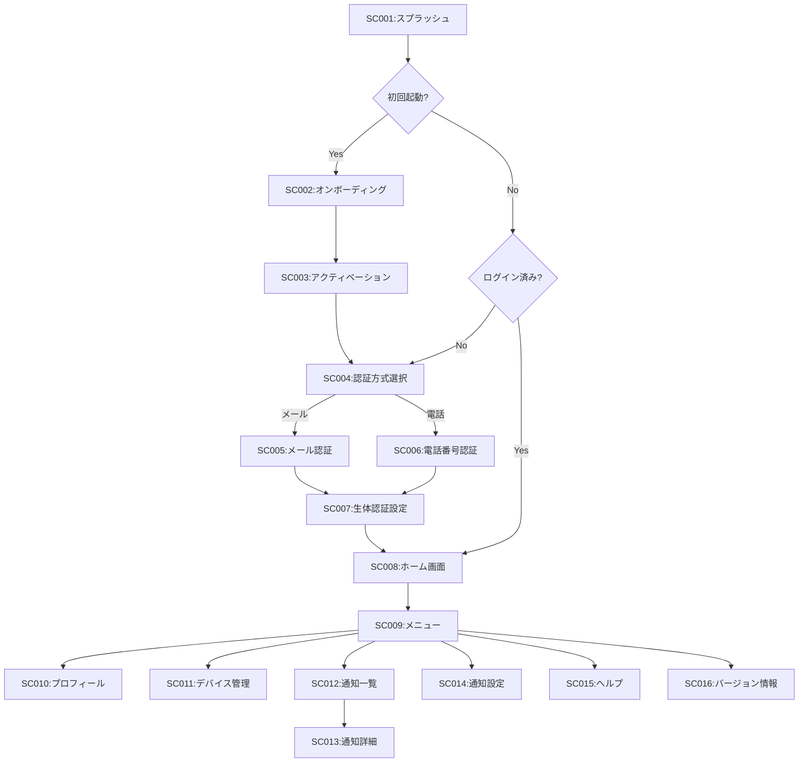
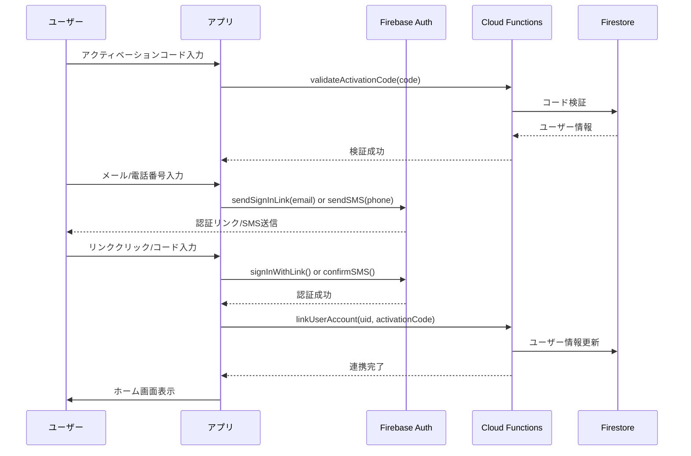
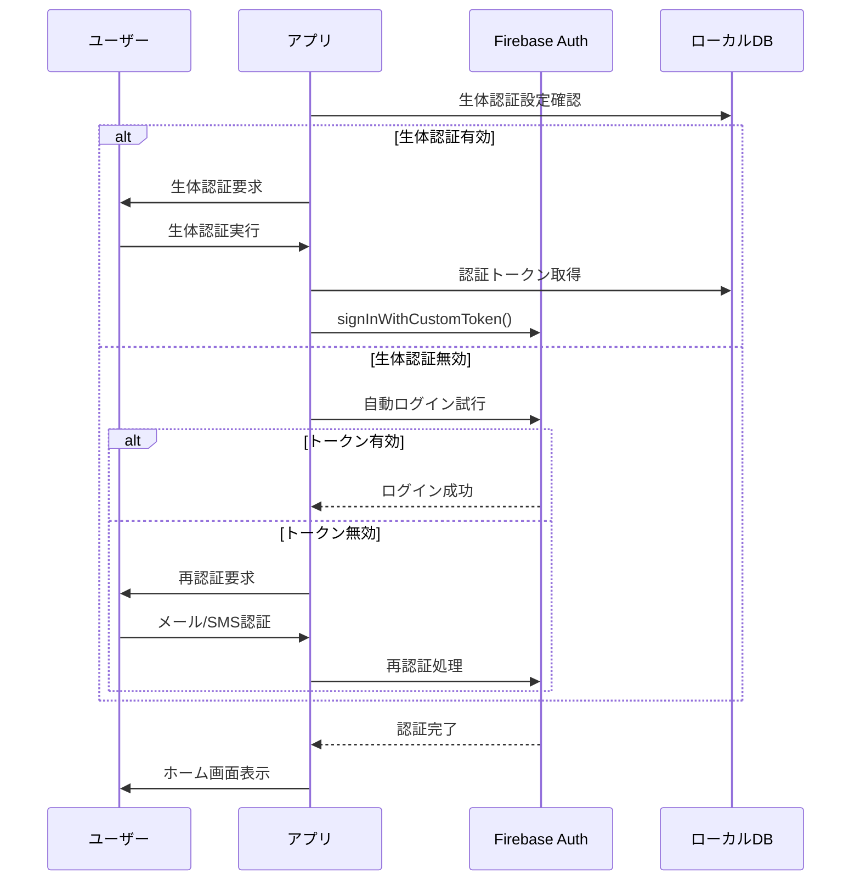

# デジタル学生証システム 機能仕様書

## 1. システム概要

### 1.1 システム構成
本システムは、Firebase をベースとしたサーバーレスアーキテクチャで構築し、高い可用性と拡張性を実現する。

```
┌─────────────────────────────────────────────────────────┐
│                     クライアント層                        │
├─────────────────────────────────────────────────────────┤
│  生徒用アプリ（Flutter）    管理画面（Next.js/React）      │
│   iOS/Android/iPadOS         Webブラウザ                 │
└────────────┬───────────────────────┬────────────────────┘
             │                       │
             ↓                       ↓
┌─────────────────────────────────────────────────────────┐
│                    Firebase Services                      │
├─────────────────────────────────────────────────────────┤
│  • Authentication（認証）                                │
│  • Firestore（データベース）                             │
│  • Cloud Functions（ビジネスロジック）                   │
│  • Cloud Storage（画像保存）                             │
│  • Cloud Messaging（通知）                               │
│  • Hosting（管理画面ホスティング）                       │
└─────────────────────────────────────────────────────────┘
             │
             ↓
┌─────────────────────────────────────────────────────────┐
│                    外部連携システム                       │
├─────────────────────────────────────────────────────────┤
│  • 図書館システム（バーコード連携）                       │
│  • 学校ホームページ（RSS）                               │
└─────────────────────────────────────────────────────────┘
```

### 1.2 技術スタック

| レイヤー | 技術 | バージョン | 用途 |
|---------|------|-----------|------|
| モバイルアプリ | Flutter | 3.0+ | iOS/Android/iPadOS共通開発 |
| 管理画面 | Next.js | 14.0+ | サーバーサイドレンダリング |
| | React | 18.0+ | UIコンポーネント |
| | TypeScript | 5.0+ | 型安全性の確保 |
| 認証 | Firebase Authentication | - | ユーザー認証・認可 |
| データベース | Cloud Firestore | - | NoSQLデータベース |
| ファイルストレージ | Cloud Storage | - | 画像ファイル保存 |
| サーバーレス関数 | Cloud Functions | Node.js 18 | バックエンド処理 |
| 通知 | Firebase Cloud Messaging | - | プッシュ通知 |
| ホスティング | Firebase Hosting | - | 管理画面ホスティング |

## 2. データモデル設計

### 2.1 Firestore コレクション構造

#### 2.1.1 users コレクション
```javascript
/users/{userId}
{
  // 基本情報
  studentId: string,           // 学籍番号
  email: string,               // メールアドレス
  phoneNumber: string,         // 電話番号（Optional）
  
  // 個人情報
  name: {
    lastName: string,          // 姓
    firstName: string,         // 名
    lastNameKana: string,      // 姓（かな）
    firstNameKana: string      // 名（かな）
  },
  
  // 学校情報
  grade: number,               // 学年（1-6、null for 卒業生）
  class: string,               // クラス（A-F、null for 卒業生）
  enrollmentYear: number,      // 入学年度
  graduationYear: number,      // 卒業年度（null for 在校生）
  
  // ステータス
  status: string,              // 'active' | 'graduated' | 'withdrawn'
  role: string,                // 'student' | 'alumni'
  
  // 写真
  photoUrl: string,            // Cloud Storage URL
  photoUpdatedAt: Timestamp,   // 写真更新日時
  
  // デバイス管理
  devices: [{
    deviceId: string,          // デバイスID
    deviceName: string,        // デバイス名
    platform: string,          // 'ios' | 'android'
    registeredAt: Timestamp,   // 登録日時
    lastAccessAt: Timestamp,   // 最終アクセス日時
    fcmToken: string          // FCMトークン
  }],
  maxDevices: number,          // 最大デバイス数（在校生:2、卒業生:1）
  
  // アクティベーション
  activationCode: string,      // アクティベーションコード
  activatedAt: Timestamp,      // アクティベーション日時
  
  // メタデータ
  createdAt: Timestamp,        // 作成日時
  updatedAt: Timestamp,        // 更新日時
  deletedAt: Timestamp         // 削除日時（論理削除）
}
```

#### 2.1.2 digitalCards コレクション
```javascript
/digitalCards/{cardId}
{
  userId: string,              // ユーザーID（users.id）
  studentId: string,           // 学籍番号
  
  // カード情報
  cardNumber: string,          // カード番号
  issueDate: Timestamp,        // 発行日
  expiryDate: Timestamp,       // 有効期限
  version: number,             // カードバージョン
  
  // 表示情報（キャッシュ用）
  displayData: {
    name: string,              // 表示名
    grade: number,             // 学年
    class: string,             // クラス
    photoUrl: string,          // 写真URL
    barcodeData: string        // バーコードデータ
  },
  
  // セキュリティ
  isActive: boolean,           // 有効/無効
  suspendedAt: Timestamp,      // 停止日時
  suspendReason: string,       // 停止理由
  
  // 署名
  principalSignature: string,  // 校長印データ（Base64）
  signatureVersion: string,    // 署名バージョン
  
  // メタデータ
  createdAt: Timestamp,
  updatedAt: Timestamp,
  createdBy: string            // 作成者（管理者ID）
}
```

#### 2.1.3 notifications コレクション
```javascript
/notifications/{notificationId}
{
  // 配信情報
  title: string,               // タイトル
  body: string,                // 本文
  imageUrls: [string],         // 画像URL配列
  category: string,            // カテゴリー
  
  // 配信対象
  targetType: string,          // 'all' | 'alumni' | 'specific'
  targetGraduationYears: [number], // 対象卒業年度
  targetUserIds: [string],     // 特定ユーザーID
  
  // 配信設定
  scheduledAt: Timestamp,      // 配信予定日時
  sentAt: Timestamp,           // 実際の配信日時
  status: string,              // 'draft' | 'scheduled' | 'sent'
  
  // 統計
  stats: {
    totalSent: number,         // 送信数
    totalOpened: number,       // 開封数
    totalClicked: number       // クリック数
  },
  
  // メタデータ
  createdAt: Timestamp,
  createdBy: string,           // 作成者（管理者ID）
  updatedAt: Timestamp
}
```

#### 2.1.4 admins コレクション
```javascript
/admins/{adminId}
{
  email: string,               // メールアドレス
  name: string,                // 氏名
  role: string,                // 'system_admin' | 'staff'
  
  // 権限
  permissions: {
    userManagement: boolean,   // ユーザー管理
    cardIssuance: boolean,     // カード発行
    notificationSend: boolean, // 通知送信
    systemSettings: boolean,   // システム設定
    dataExport: boolean        // データエクスポート
  },
  
  // セキュリティ
  allowedIPs: [string],        // 許可IPアドレス
  lastLoginAt: Timestamp,      // 最終ログイン日時
  loginHistory: [{
    timestamp: Timestamp,
    ipAddress: string,
    userAgent: string,
    success: boolean
  }],
  
  // メタデータ
  isActive: boolean,
  createdAt: Timestamp,
  updatedAt: Timestamp,
  createdBy: string
}
```

#### 2.1.5 systemConfig コレクション
```javascript
/systemConfig/settings
{
  school: {
    name: string,              // 学校名
    address: string,           // 住所
    phone: string,             // 電話番号
    email: string,             // メールアドレス
    principalName: string      // 校長名
  },
  
  currentYear: {
    academicYear: number,      // 年度
    semester: number           // 学期
  },
  
  cardSettings: {
    expiryMonths: number,      // 有効期限（月数）
    principalSignature: string, // 校長印画像（Base64）
    signatureVersion: string   // 署名バージョン
  },
  
  limits: {
    maxDevicesStudent: number,  // 在校生の最大デバイス数
    maxDevicesAlumni: number,   // 卒業生の最大デバイス数
    photoMaxSizeMB: number,     // 写真最大サイズ
    notificationMaxImages: number // 通知の最大画像数
  },
  
  maintenance: {
    isUnderMaintenance: boolean,
    maintenanceMessage: string,
    scheduledMaintenances: [{
      startTime: Timestamp,
      endTime: Timestamp,
      description: string
    }]
  },
  
  updatedAt: Timestamp,
  updatedBy: string
}
```

#### 2.1.6 auditLogs コレクション
```javascript
/auditLogs/{logId}
{
  timestamp: Timestamp,        // 操作日時
  userId: string,              // 操作者ID
  userType: string,            // 'admin' | 'student' | 'alumni'
  action: string,              // 操作種別
  
  // 操作詳細
  details: {
    collection: string,        // 対象コレクション
    documentId: string,        // 対象ドキュメントID
    operation: string,         // 'create' | 'update' | 'delete' | 'read'
    before: object,            // 変更前データ
    after: object              // 変更後データ
  },
  
  // 環境情報
  metadata: {
    ipAddress: string,
    userAgent: string,
    platform: string
  },
  
  // 結果
  success: boolean,
  errorMessage: string
}
```

### 2.2 Cloud Storage 構造
```
/student-photos/
  /{userId}/
    /original.jpg          // オリジナル画像
    /thumbnail.jpg         // サムネイル（200x200）
    /card.jpg             // カード用（400x500）

/principal-signatures/
  /{version}/
    /signature.png        // 校長印画像

/notification-images/
  /{notificationId}/
    /{imageId}.jpg        // 通知用画像

/exports/
  /users/
    /{timestamp}.csv      // ユーザーデータエクスポート
  /logs/
    /{timestamp}.csv      // ログエクスポート
```

## 3. 生徒用アプリケーション仕様

### 3.1 画面構成

#### 3.1.1 画面一覧
| 画面ID | 画面名 | 説明 | 認証要否 |
|--------|--------|------|----------|
| SC001 | スプラッシュ画面 | アプリ起動時の画面 | 不要 |
| SC002 | オンボーディング | 初回起動時の説明画面 | 不要 |
| SC003 | アクティベーション | アクティベーションコード入力 | 不要 |
| SC004 | 認証方式選択 | メール/電話番号選択 | 不要 |
| SC005 | メール認証 | メールリンク認証 | 不要 |
| SC006 | 電話番号認証 | SMS認証 | 不要 |
| SC007 | 生体認証設定 | Face ID/Touch ID設定 | 必要 |
| SC008 | ホーム画面 | メイン画面（生徒証表示） | 必要 |
| SC009 | メニュー | 各種設定メニュー | 必要 |
| SC010 | プロフィール | 個人情報表示・編集 | 必要 |
| SC011 | デバイス管理 | 登録デバイス一覧・削除 | 必要 |
| SC012 | 通知一覧 | 通知メッセージ一覧（卒業生のみ） | 必要 |
| SC013 | 通知詳細 | 通知メッセージ詳細（卒業生のみ） | 必要 |
| SC014 | 通知設定 | 通知カテゴリー設定（卒業生のみ） | 必要 |
| SC015 | ヘルプ | ヘルプ・FAQ | 必要 |
| SC016 | バージョン情報 | アプリバージョン・ライセンス | 必要 |

#### 3.1.2 画面遷移図


### 3.2 画面詳細仕様

#### 3.2.1 SC008:ホーム画面（生徒証表示）

**画面概要**
デジタル生徒証を表示するメイン画面。オフラインでも表示可能。

**画面レイアウト**
```
┌─────────────────────────────┐
│      ○○学園 生徒証         │ ← ヘッダー
├─────────────────────────────┤
│                             │
│     [顔写真]                │ ← 写真エリア
│                             │
├─────────────────────────────┤
│ 氏名: 山田 太郎             │
│ よみ: やまだ たろう         │
│ 学年: 3年 B組               │
│ 学籍番号: 2021001           │
├─────────────────────────────┤
│ 有効期限: 2025年3月31日     │
├─────────────────────────────┤
│     [バーコード]            │ ← 図書館用
├─────────────────────────────┤
│     [QRコード]              │ ← 認証用（動的）
├─────────────────────────────┤
│        [校長印]             │
└─────────────────────────────┘
```

**表示要素**

| 要素 | 内容 | データソース | 更新頻度 |
|------|------|-------------|----------|
| 顔写真 | 生徒の証明写真 | Storage (キャッシュ) | 年1回 |
| 氏名 | 姓名（漢字） | Firestore (キャッシュ) | 変更時 |
| よみ | 姓名（ひらがな） | Firestore (キャッシュ) | 変更時 |
| 学年・クラス | 現在の学年とクラス | Firestore | 年度更新時 |
| 学籍番号 | 固有の番号 | Firestore (キャッシュ) | 不変 |
| 有効期限 | カードの有効期限 | Firestore | 発行時 |
| バーコード | Code128形式 | ローカル生成 | 起動時 |
| QRコード | 認証用トークン | ローカル生成 | 30秒ごと |
| 校長印 | デジタル署名付き | Storage (キャッシュ) | 年度更新時 |

**機能仕様**

1. **オフライン対応**
   - 初回ログイン後、データをローカルにキャッシュ
   - オフライン時は最後にキャッシュしたデータを表示
   - オンライン復帰時に自動同期

2. **QRコード動的生成**
   ```javascript
   // QRコードデータ構造
   {
     userId: string,
     timestamp: number,
     nonce: string,
     signature: string  // HMAC-SHA256
   }
   ```

3. **画面の明るさ自動調整**
   - バーコード/QRコード表示時、画面輝度を最大に
   - 5秒後に元の輝度に戻す

4. **セキュリティ機能**
   - スクリーンショット防止（iOS）
   - 画面録画防止（iOS）
   - 3分間操作なしで自動ロック
   - 生体認証での再ロック解除

### 3.3 認証フロー

#### 3.3.1 初回登録フロー


#### 3.3.2 2回目以降のログインフロー


## 4. 教職員用管理システム仕様

### 4.1 画面構成

#### 4.1.1 画面一覧
| 画面ID | 画面名 | 説明 | 必要権限 |
|--------|--------|------|----------|
| AD001 | ログイン | 管理者ログイン画面 | なし |
| AD002 | ダッシュボード | 統計情報表示 | staff以上 |
| AD003 | 生徒一覧 | 生徒情報一覧・検索 | staff以上 |
| AD004 | 生徒詳細 | 個別生徒情報表示・編集 | staff以上 |
| AD005 | 生徒新規登録 | 新規生徒登録 | staff以上 |
| AD006 | 一括登録 | CSV一括登録 | staff以上 |
| AD007 | カード発行 | デジタルカード発行・再発行 | staff以上 |
| AD008 | 年次処理 | 入学/昇級/卒業/除籍処理 | staff以上 |
| AD009 | 通知作成 | 通知メッセージ作成 | staff以上 |
| AD010 | 通知履歴 | 配信履歴・統計 | staff以上 |
| AD011 | 管理者一覧 | 管理者アカウント一覧 | system_admin |
| AD012 | 管理者編集 | 管理者情報編集 | system_admin |
| AD013 | システム設定 | 各種設定 | system_admin |
| AD014 | 監査ログ | 操作ログ一覧 | system_admin |
| AD015 | バックアップ | データバックアップ・リストア | system_admin |

### 4.2 主要機能詳細

#### 4.2.1 AD006:一括登録機能

**CSVフォーマット**
```csv
学籍番号,姓,名,姓かな,名かな,学年,クラス,メールアドレス,電話番号
2024001,山田,太郎,やまだ,たろう,1,A,yamada@example.com,090-1234-5678
2024002,鈴木,花子,すずき,はなこ,1,A,suzuki@example.com,080-9876-5432
```

**処理フロー**
1. CSVファイルアップロード（最大1000件）
2. フォーマット検証
3. 重複チェック（学籍番号）
4. プレビュー表示
5. 確認後、一括登録実行
6. アクティベーションコード自動生成
7. 結果レポート出力（成功/失敗リスト）

**エラーハンドリング**
- 必須項目チェック
- 形式チェック（メール、電話番号）
- 重複チェック
- トランザクション処理（全件成功or全件ロールバック）

#### 4.2.2 AD008:年次処理機能

**入学処理**
```javascript
// Cloud Functions実装
async function processNewStudents(data) {
  const batch = firestore.batch();
  
  for (const student of data.students) {
    // 学籍番号自動採番
    const studentId = generateStudentId(data.year);
    
    // ユーザードキュメント作成
    const userRef = firestore.collection('users').doc();
    batch.set(userRef, {
      studentId,
      ...student,
      status: 'active',
      role: 'student',
      enrollmentYear: data.year,
      devices: [],
      maxDevices: 2,
      createdAt: FieldValue.serverTimestamp()
    });
    
    // アクティベーションコード生成
    const activationCode = generateActivationCode();
    batch.update(userRef, { activationCode });
    
    // デジタルカード作成
    const cardRef = firestore.collection('digitalCards').doc();
    batch.set(cardRef, {
      userId: userRef.id,
      studentId,
      cardNumber: generateCardNumber(),
      issueDate: FieldValue.serverTimestamp(),
      expiryDate: calculateExpiryDate(),
      version: 1,
      isActive: false, // アクティベーション後に有効化
      createdAt: FieldValue.serverTimestamp()
    });
  }
  
  await batch.commit();
}
```

**昇級処理**
```javascript
async function processGradeAdvancement() {
  const batch = firestore.batch();
  
  // 全在校生取得
  const students = await firestore
    .collection('users')
    .where('status', '==', 'active')
    .get();
  
  students.forEach(doc => {
    const data = doc.data();
    const newGrade = data.grade + 1;
    
    if (newGrade <= 6) {
      // 昇級
      batch.update(doc.ref, {
        grade: newGrade,
        class: assignNewClass(doc.id, newGrade),
        updatedAt: FieldValue.serverTimestamp()
      });
    }
  });
  
  await batch.commit();
}
```

**卒業処理**
```javascript
async function processGraduation(year) {
  const batch = firestore.batch();
  
  // 6年生取得
  const graduates = await firestore
    .collection('users')
    .where('status', '==', 'active')
    .where('grade', '==', 6)
    .get();
  
  graduates.forEach(doc => {
    // ステータス更新
    batch.update(doc.ref, {
      status: 'graduated',
      role: 'alumni',
      graduationYear: year,
      grade: null,
      class: null,
      maxDevices: 1, // デバイス数制限変更
      updatedAt: FieldValue.serverTimestamp()
    });
    
    // カード更新
    // 新しい有効期限でカード再発行
  });
  
  await batch.commit();
}
```

## 5. Cloud Functions 実装仕様

### 5.1 関数一覧

| 関数名 | トリガー | 説明 | 実行権限 |
|--------|---------|------|----------|
| validateActivationCode | HTTPS | アクティベーションコード検証 | 公開 |
| linkUserAccount | HTTPS | ユーザーアカウント連携 | 認証済み |
| generateDigitalCard | HTTPS | デジタルカード生成 | Admin |
| processCSVUpload | Storage | CSV一括登録処理 | - |
| resizeStudentPhoto | Storage | 生徒写真リサイズ | - |
| sendNotification | HTTPS | 通知送信 | Admin |
| exportData | HTTPS | データエクスポート | Admin |
| performBackup | Scheduler | 定期バックアップ | - |
| cleanupOldData | Scheduler | 古いデータ削除 | - |
| updateCardExpiry | Scheduler | カード有効期限更新 | - |
| generateAuditReport | HTTPS | 監査レポート生成 | Admin |

### 5.2 主要関数詳細

#### 5.2.1 validateActivationCode
```typescript
import * as functions from 'firebase-functions';
import * as admin from 'firebase-admin';

export const validateActivationCode = functions
  .region('asia-northeast1')
  .https.onCall(async (data, context) => {
    const { code } = data;
    
    if (!code || code.length !== 8) {
      throw new functions.https.HttpsError(
        'invalid-argument',
        'Invalid activation code format'
      );
    }
    
    // コード検証
    const userSnapshot = await admin
      .firestore()
      .collection('users')
      .where('activationCode', '==', code)
      .where('activatedAt', '==', null)
      .limit(1)
      .get();
    
    if (userSnapshot.empty) {
      throw new functions.https.HttpsError(
        'not-found',
        'Invalid or expired activation code'
      );
    }
    
    const userData = userSnapshot.docs[0].data();
    
    return {
      success: true,
      userId: userSnapshot.docs[0].id,
      studentId: userData.studentId,
      name: `${userData.name.lastName} ${userData.name.firstName}`
    };
  });
```

#### 5.2.2 resizeStudentPhoto
```typescript
import * as functions from 'firebase-functions';
import * as admin from 'firebase-admin';
import * as sharp from 'sharp';

export const resizeStudentPhoto = functions
  .region('asia-northeast1')
  .storage.object()
  .onFinalize(async (object) => {
    const filePath = object.name;
    
    // student-photos/original/ のみ処理
    if (!filePath?.startsWith('student-photos/') || 
        !filePath.includes('/original/')) {
      return;
    }
    
    const bucket = admin.storage().bucket();
    const fileName = filePath.split('/').pop();
    const userId = filePath.split('/')[1];
    
    // オリジナル画像取得
    const originalFile = bucket.file(filePath);
    const [buffer] = await originalFile.download();
    
    // リサイズ処理
    const sizes = [
      { name: 'thumbnail', width: 200, height: 200 },
      { name: 'card', width: 400, height: 500 }
    ];
    
    const uploadPromises = sizes.map(async (size) => {
      const resizedBuffer = await sharp(buffer)
        .resize(size.width, size.height, {
          fit: 'cover',
          position: 'center'
        })
        .jpeg({ quality: 85 })
        .toBuffer();
      
      const resizedPath = `student-photos/${userId}/${size.name}.jpg`;
      const resizedFile = bucket.file(resizedPath);
      
      await resizedFile.save(resizedBuffer, {
        metadata: {
          contentType: 'image/jpeg',
          cacheControl: 'public, max-age=31536000'
        }
      });
      
      return resizedFile.publicUrl();
    });
    
    const urls = await Promise.all(uploadPromises);
    
    // Firestoreのユーザー情報更新
    await admin.firestore()
      .collection('users')
      .doc(userId)
      .update({
        photoUrl: urls[1], // card size
        photoThumbnail: urls[0],
        photoUpdatedAt: admin.firestore.FieldValue.serverTimestamp()
      });
  });
```

## 6. セキュリティ設計

### 6.1 Firestore セキュリティルール

```javascript
rules_version = '2';
service cloud.firestore {
  match /databases/{database}/documents {
    
    // ヘルパー関数
    function isAuthenticated() {
      return request.auth != null;
    }
    
    function isOwner(userId) {
      return isAuthenticated() && request.auth.uid == userId;
    }
    
    function isAdmin() {
      return isAuthenticated() && 
        exists(/databases/$(database)/documents/admins/$(request.auth.uid));
    }
    
    function isSystemAdmin() {
      return isAdmin() && 
        get(/databases/$(database)/documents/admins/$(request.auth.uid)).data.role == 'system_admin';
    }
    
    // users コレクション
    match /users/{userId} {
      // 読み取り：本人またはAdmin
      allow read: if isOwner(userId) || isAdmin();
      
      // 作成：Adminのみ
      allow create: if isAdmin();
      
      // 更新：限定的なフィールドのみ本人可、全フィールドはAdmin
      allow update: if isOwner(userId) && 
        request.resource.data.diff(resource.data).affectedKeys()
          .hasOnly(['phoneNumber', 'email', 'devices']) ||
        isAdmin();
      
      // 削除：SystemAdminのみ
      allow delete: if isSystemAdmin();
    }
    
    // digitalCards コレクション
    match /digitalCards/{cardId} {
      // 読み取り：カード所有者またはAdmin
      allow read: if isAuthenticated() && 
        (resource.data.userId == request.auth.uid || isAdmin());
      
      // 作成・更新・削除：Adminのみ
      allow create, update, delete: if isAdmin();
    }
    
    // notifications コレクション
    match /notifications/{notificationId} {
      // 読み取り：卒業生またはAdmin
      allow read: if isAuthenticated() && 
        (get(/databases/$(database)/documents/users/$(request.auth.uid)).data.role == 'alumni' ||
         isAdmin());
      
      // 作成・更新・削除：Adminのみ
      allow create, update, delete: if isAdmin();
    }
    
    // admins コレクション
    match /admins/{adminId} {
      // 読み取り：Admin自身
      allow read: if isOwner(adminId) || isSystemAdmin();
      
      // 作成・更新・削除：SystemAdminのみ
      allow create, update, delete: if isSystemAdmin();
    }
    
    // systemConfig コレクション
    match /systemConfig/{document} {
      // 読み取り：認証済みユーザー
      allow read: if isAuthenticated();
      
      // 更新：SystemAdminのみ
      allow update: if isSystemAdmin();
      
      // 作成・削除：禁止
      allow create, delete: if false;
    }
    
    // auditLogs コレクション
    match /auditLogs/{logId} {
      // 読み取り：SystemAdminのみ
      allow read: if isSystemAdmin();
      
      // 作成：システムのみ（Cloud Functions経由）
      allow create: if false;
      
      // 更新・削除：禁止
      allow update, delete: if false;
    }
  }
}
```

### 6.2 Cloud Storage セキュリティルール

```javascript
rules_version = '2';
service firebase.storage {
  match /b/{bucket}/o {
    
    // ヘルパー関数
    function isAuthenticated() {
      return request.auth != null;
    }
    
    function isAdmin() {
      return isAuthenticated() && 
        firestore.exists(/databases/(default)/documents/admins/$(request.auth.uid));
    }
    
    // 生徒写真
    match /student-photos/{userId}/{fileName} {
      // 読み取り：認証済みユーザー
      allow read: if isAuthenticated();
      
      // 書き込み：Adminのみ、画像ファイルのみ、5MB以下
      allow write: if isAdmin() && 
        request.resource.contentType.matches('image/.*') &&
        request.resource.size < 5 * 1024 * 1024;
      
      // 削除：Adminのみ
      allow delete: if isAdmin();
    }
    
    // 校長印
    match /principal-signatures/{version}/{fileName} {
      // 読み取り：認証済みユーザー
      allow read: if isAuthenticated();
      
      // 書き込み・削除：SystemAdminのみ
      allow write, delete: if isAdmin() && 
        firestore.get(/databases/(default)/documents/admins/$(request.auth.uid)).data.role == 'system_admin';
    }
    
    // 通知画像
    match /notification-images/{notificationId}/{imageId} {
      // 読み取り：認証済みユーザー
      allow read: if isAuthenticated();
      
      // 書き込み：Adminのみ、画像ファイルのみ、2MB以下
      allow write: if isAdmin() && 
        request.resource.contentType.matches('image/.*') &&
        request.resource.size < 2 * 1024 * 1024;
      
      // 削除：Adminのみ
      allow delete: if isAdmin();
    }
    
    // エクスポートファイル
    match /exports/{type}/{fileName} {
      // 読み取り・書き込み：Adminのみ
      allow read, write: if isAdmin();
      
      // 削除：SystemAdminのみ
      allow delete: if isAdmin() && 
        firestore.get(/databases/(default)/documents/admins/$(request.auth.uid)).data.role == 'system_admin';
    }
  }
}
```

### 6.3 API セキュリティ

#### 6.3.1 認証・認可
- Firebase Authentication によるJWT認証
- カスタムクレームによる権限管理
- APIレート制限（1分あたり60リクエスト）

#### 6.3.2 データ保護
- HTTPS通信の強制
- 個人情報のマスキング（ログ出力時）
- SQLインジェクション対策（Firestoreのパラメータバインディング）
- XSS対策（入力値のサニタイズ）

## 7. 外部連携仕様

### 7.1 図書館システム連携

**バーコード仕様**
- 形式：Code128
- データ：学籍番号（8桁）
- エンコーディング：UTF-8

**連携方式**
- オフライン連携（バーコード読み取りのみ）
- 図書館システム側で学籍番号を管理

### 7.2 学校ホームページ連携

**RSS取得仕様**
```typescript
// Cloud Functions定期実行（1日1回）
export const fetchSchoolNews = functions
  .region('asia-northeast1')
  .pubsub.schedule('every day 06:00')
  .timeZone('Asia/Tokyo')
  .onRun(async (context) => {
    const rssUrl = 'https://school.example.jp/rss/news.xml';
    
    // RSS取得
    const response = await fetch(rssUrl);
    const rssData = await response.text();
    
    // パース処理
    const news = parseRSS(rssData);
    
    // 新着ニュースを通知として保存
    const batch = admin.firestore().batch();
    
    news.forEach(item => {
      const notificationRef = admin.firestore()
        .collection('notifications')
        .doc();
      
      batch.set(notificationRef, {
        title: item.title,
        body: item.description,
        category: 'school_news',
        targetType: 'alumni',
        scheduledAt: admin.firestore.FieldValue.serverTimestamp(),
        status: 'scheduled',
        createdAt: admin.firestore.FieldValue.serverTimestamp()
      });
    });
    
    await batch.commit();
  });
```

## 8. パフォーマンス最適化

### 8.1 キャッシュ戦略

**クライアントキャッシュ**
```dart
// Flutter実装例
class CacheManager {
  static const Duration userDataCacheDuration = Duration(hours: 24);
  static const Duration photosCacheDuration = Duration(days: 30);
  static const Duration configCacheDuration = Duration(hours: 6);
  
  // Firestore オフライン永続化
  await FirebaseFirestore.instance.enablePersistence();
  
  // 画像キャッシュ（flutter_cache_manager使用）
  final customCacheManager = CacheManager(
    Config(
      'studentPhotos',
      stalePeriod: photosCacheDuration,
      maxNrOfCacheObjects: 100,
    ),
  );
}
```

**CDNキャッシュ**
- Firebase Hosting 自動CDN
- Cloud Storage のCDNキャッシュ設定
- Cache-Control: public, max-age=31536000（静的リソース）

### 8.2 データベース最適化

**インデックス設計**
```javascript
// firestore.indexes.json
{
  "indexes": [
    {
      "collectionGroup": "users",
      "queryScope": "COLLECTION",
      "fields": [
        { "fieldPath": "status", "order": "ASCENDING" },
        { "fieldPath": "grade", "order": "ASCENDING" },
        { "fieldPath": "class", "order": "ASCENDING" }
      ]
    },
    {
      "collectionGroup": "users",
      "queryScope": "COLLECTION",
      "fields": [
        { "fieldPath": "graduationYear", "order": "DESCENDING" },
        { "fieldPath": "status", "order": "ASCENDING" }
      ]
    },
    {
      "collectionGroup": "notifications",
      "queryScope": "COLLECTION",
      "fields": [
        { "fieldPath": "targetType", "order": "ASCENDING" },
        { "fieldPath": "createdAt", "order": "DESCENDING" }
      ]
    },
    {
      "collectionGroup": "auditLogs",
      "queryScope": "COLLECTION",
      "fields": [
        { "fieldPath": "timestamp", "order": "DESCENDING" },
        { "fieldPath": "userId", "order": "ASCENDING" }
      ]
    }
  ]
}
```

**クエリ最適化**
- ページネーション実装（limit + startAfter）
- 必要なフィールドのみ取得（select）
- バッチ処理の活用（500件単位）

## 9. エラーハンドリング

### 9.1 エラーコード体系

| コード | カテゴリ | 説明 | ユーザー表示メッセージ |
|--------|---------|------|----------------------|
| AUTH001 | 認証 | アクティベーションコード無効 | 入力されたコードが正しくありません |
| AUTH002 | 認証 | 認証期限切れ | セッションの有効期限が切れました。再度ログインしてください |
| AUTH003 | 認証 | デバイス数上限 | 登録可能なデバイス数の上限に達しています |
| DATA001 | データ | 必須項目未入力 | 必須項目を入力してください |
| DATA002 | データ | 形式エラー | 入力形式が正しくありません |
| DATA003 | データ | 重複エラー | すでに登録されています |
| SYS001 | システム | ネットワークエラー | 通信エラーが発生しました。しばらくしてから再度お試しください |
| SYS002 | システム | サーバーエラー | システムエラーが発生しました。管理者にお問い合わせください |
| SYS003 | システム | メンテナンス中 | 現在メンテナンス中です。しばらくお待ちください |

### 9.2 リトライ処理

```typescript
// Cloud Functions実装例
async function retryableOperation<T>(
  operation: () => Promise<T>,
  maxRetries: number = 3,
  delay: number = 1000
): Promise<T> {
  let lastError: Error;
  
  for (let i = 0; i < maxRetries; i++) {
    try {
      return await operation();
    } catch (error) {
      lastError = error as Error;
      
      // リトライ可能なエラーか判定
      if (!isRetryableError(error)) {
        throw error;
      }
      
      // 指数バックオフ
      const waitTime = delay * Math.pow(2, i);
      await new Promise(resolve => setTimeout(resolve, waitTime));
    }
  }
  
  throw lastError!;
}

function isRetryableError(error: any): boolean {
  // ネットワークエラー、タイムアウト、一時的なエラー
  return error.code === 'unavailable' ||
         error.code === 'deadline-exceeded' ||
         error.code === 'resource-exhausted';
}
```

## 10. テスト仕様

### 10.1 単体テスト

**Flutter単体テスト**
```dart
// test/services/auth_service_test.dart
import 'package:flutter_test/flutter_test.dart';
import 'package:mockito/mockito.dart';

void main() {
  group('AuthService', () {
    test('validateActivationCode should return user data when code is valid', () async {
      // Arrange
      final mockFirestore = MockFirebaseFirestore();
      final authService = AuthService(firestore: mockFirestore);
      
      when(mockFirestore.collection('users')
        .where('activationCode', isEqualTo: 'TEST1234')
        .get())
        .thenAnswer((_) async => mockQuerySnapshot);
      
      // Act
      final result = await authService.validateActivationCode('TEST1234');
      
      // Assert
      expect(result.isValid, true);
      expect(result.userId, isNotNull);
    });
  });
}
```

**Cloud Functions単体テスト**
```typescript
// test/functions/validateActivationCode.test.ts
import * as functions from 'firebase-functions-test';
import * as admin from 'firebase-admin';

describe('validateActivationCode', () => {
  it('should validate correct activation code', async () => {
    // Arrange
    const wrapped = test.wrap(validateActivationCode);
    const data = { code: 'TEST1234' };
    const context = { auth: null };
    
    // Mock Firestore
    jest.spyOn(admin.firestore(), 'collection')
      .mockReturnValue({
        where: jest.fn().mockReturnThis(),
        limit: jest.fn().mockReturnThis(),
        get: jest.fn().mockResolvedValue({
          empty: false,
          docs: [{ data: () => mockUserData }]
        })
      });
    
    // Act
    const result = await wrapped(data, context);
    
    // Assert
    expect(result.success).toBe(true);
    expect(result.userId).toBeDefined();
  });
});
```

### 10.2 統合テスト

**E2Eテストシナリオ**
1. 新規登録フロー
2. ログイン・ログアウト
3. 生徒証表示
4. デバイス管理
5. 管理者による生徒登録
6. CSVー括登録
7. 年次処理

### 10.3 負荷テスト

**Apache JMeter設定**
- 同時接続数：1000
- ランプアップ時間：60秒
- テスト時間：30分
- 目標レスポンスタイム：200ms以下

## 11. デプロイメント

### 11.1 環境構成

| 環境 | 用途 | Firebase Project |
|------|------|-----------------|
| Development | 開発環境 | school-digital-id-dev |
| Staging | テスト環境 | school-digital-id-staging |
| Production | 本番環境 | school-digital-id-prod |

### 11.2 CI/CDパイプライン

```yaml
# .github/workflows/deploy.yml
name: Deploy to Firebase

on:
  push:
    branches:
      - main
      - develop

jobs:
  deploy:
    runs-on: ubuntu-latest
    
    steps:
      - uses: actions/checkout@v2
      
      - name: Setup Node.js
        uses: actions/setup-node@v2
        with:
          node-version: '18'
      
      - name: Install dependencies
        run: |
          npm install
          cd functions && npm install
      
      - name: Run tests
        run: npm test
      
      - name: Build
        run: npm run build
      
      - name: Deploy to Firebase
        run: |
          if [ "${{ github.ref }}" == "refs/heads/main" ]; then
            firebase deploy --project production
          else
            firebase deploy --project staging
          fi
        env:
          FIREBASE_TOKEN: ${{ secrets.FIREBASE_TOKEN }}
```

### 11.3 モニタリング

**Firebase Performance Monitoring**
- 自動トレース（アプリ起動、画面遷移）
- カスタムトレース（重要な処理）
- ネットワークリクエスト監視

**Cloud Monitoring ダッシュボード**
- API レスポンスタイム
- エラー率
- アクティブユーザー数
- Cloud Functions 実行時間

**アラート設定**
- エラー率 > 1%
- レスポンスタイム > 500ms
- ダウンタイム検知

## 12. 運用・保守

### 12.1 バックアップ

**自動バックアップ**
- Firestore：日次バックアップ（Cloud Scheduler）
- Storage：週次バックアップ
- 保持期間：30日

**手動バックアップ**
- 管理画面から実行可能
- エクスポート形式：JSON/CSV

### 12.2 ログ管理

**ログ収集**
- Cloud Logging 自動収集
- 構造化ログ形式
- 90日間保持

**監査ログ**
- 全管理者操作を記録
- 改ざん防止（Write Once）
- コンプライアンス対応

### 12.3 アップデート

**アプリアップデート**
- 強制アップデート機能
- Remote Config による機能フラグ
- 段階的ロールアウト

**メンテナンスウィンドウ**
- 毎月第3日曜日 2:00-5:00
- メンテナンスモード自動切替
- 事前通知（1週間前）

## 改訂履歴

| 版数 | 日付 | 改訂内容 | 作成者 |
|-----|-----|---------|--------|
| 1.0 | 2024/01/20 | 初版作成 | システム設計担当 |