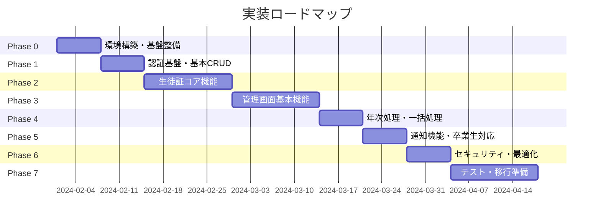

# デジタル学生証システム 段階的実装ロードマップ

## 実装フェーズ概要



## Phase 0: 環境構築・基盤整備（1週間）

### 目的
開発環境の構築とプロジェクトの基盤整備

### 実装内容

#### 1. Firebase エミュレータセットアップ
```bash
# Firebaseエミュレータの設定（実プロジェクトは作成しない）
firebase init emulators

# エミュレータで使用するサービスを選択
# - Authentication
# - Firestore
# - Functions
# - Storage
# - Hosting
```

**使用環境**: Firebaseエミュレータのみ（実プロジェクトは作成しない）

#### 2. 開発環境構築
```bash
# リポジトリ構成
kaisei_id_card/
├── apps/
│   ├── student-app/        # Flutter アプリ
│   └── admin-web/          # Next.js 管理画面
├── packages/
│   ├── shared/            # 共通型定義・ユーティリティ
│   └── firebase-config/   # Firebase設定
├── functions/             # Cloud Functions
├── firestore.rules       # セキュリティルール
├── storage.rules         # ストレージルール
└── firebase.json         # Firebase設定
```

#### 3. 基本設定ファイル作成
```typescript
// packages/shared/src/types/user.ts
export interface User {
  id: string;
  studentId: string;
  email: string;
  name: {
    lastName: string;
    firstName: string;
    lastNameKana: string;
    firstNameKana: string;
  };
  status: 'active' | 'graduated' | 'withdrawn';
  role: 'student' | 'alumni';
}
```

#### 4. CI/CD パイプライン構築
```yaml
# .github/workflows/ci.yml
name: CI
on: [push, pull_request]
jobs:
  test:
    runs-on: ubuntu-latest
    steps:
      - uses: actions/checkout@v3
      - run: npm ci
      - run: npm test
      - run: npm run lint
```

### 成果物
- [ ] Firebaseエミュレータ設定完了
- [ ] モノレポ構成のGitリポジトリ
- [ ] 基本的な型定義
- [ ] CI/CDパイプライン

### 完了条件
- ローカルでFirebase Emulatorが起動する
- FlutterアプリとNext.jsが起動する

---

## Phase 1: 認証基盤・基本CRUD（1週間）

### 目的
Firebase Authentication の実装と基本的なCRUD操作の確立

**使用環境**: Firebaseエミュレータのみ

### 実装内容

#### 1. Firebase Authentication 設定
```typescript
// functions/src/auth/activation.ts
export const validateActivationCode = functions
  .region('asia-northeast1')
  .https.onCall(async (data, context) => {
    const { code } = data;
    // アクティベーションコード検証ロジック
    const user = await validateCode(code);
    if (!user) throw new HttpsError('not-found', 'Invalid code');
    
    // カスタムトークン生成
    const token = await admin.auth().createCustomToken(user.id);
    return { token, user };
  });
```

#### 2. Firestore 基本コレクション作成
```typescript
// スクリプトで初期データ投入
const initializeFirestore = async () => {
  // テストユーザー作成
  await db.collection('users').add({
    studentId: '2024001',
    name: { lastName: 'テスト', firstName: '太郎' },
    status: 'active',
    role: 'student',
    activationCode: 'TEST1234'
  });
};
```

#### 3. Flutter 認証画面実装
```dart
// apps/student-app/lib/features/auth/activation_screen.dart
class ActivationScreen extends StatelessWidget {
  Future<void> _activate(String code) async {
    final result = await FirebaseFunctions.instance
      .httpsCallable('validateActivationCode')
      .call({'code': code});
    
    // カスタムトークンでログイン
    await FirebaseAuth.instance
      .signInWithCustomToken(result.data['token']);
  }
}
```

#### 4. セキュリティルール（最小限）
```javascript
// firestore.rules
rules_version = '2';
service cloud.firestore {
  match /databases/{database}/documents {
    match /users/{userId} {
      allow read: if request.auth.uid == userId;
      allow write: if false; // 初期は読み取りのみ
    }
  }
}
```

### 成果物
- [ ] アクティベーションコード検証API
- [ ] 基本的な認証フロー
- [ ] ユーザーコレクションCRUD
- [ ] 最小限のセキュリティルール

### 完了条件
- アクティベーションコードでログインできる
- ログイン後、自分のユーザー情報が取得できる

---

## Phase 2: 生徒証コア機能（2週間）

### 目的
デジタル生徒証の表示機能とオフライン対応の実装

**使用環境**: 前半はエミュレータ、後半で開発環境（kaisei-id-card-dev）構築・使用開始

### 実装内容

#### 1. 生徒証データモデル実装
```dart
// apps/student-app/lib/models/digital_card.dart
@freezed
class DigitalCard with _$DigitalCard {
  factory DigitalCard({
    required String id,
    required String userId,
    required String studentId,
    required DateTime issueDate,
    required DateTime expiryDate,
    required bool isActive,
    String? photoUrl,
    String? barcodeData,
  }) = _DigitalCard;
}
```

#### 2. オフラインキャッシュ実装
```dart
// Hive を使用したローカルストレージ
class CardCacheService {
  Future<void> cacheCard(DigitalCard card) async {
    final box = await Hive.openBox<DigitalCard>('cards');
    await box.put(card.id, card);
  }
  
  Future<DigitalCard?> getCachedCard() async {
    final box = await Hive.openBox<DigitalCard>('cards');
    return box.values.firstOrNull;
  }
}
```

#### 3. 生徒証画面UI実装
```dart
// カード表示Widget
class StudentCardWidget extends StatelessWidget {
  Widget build(BuildContext context) {
    return Card(
      child: Column(
        children: [
          CachedNetworkImage(imageUrl: card.photoUrl),
          Text(user.name),
          BarcodeWidget(data: card.barcodeData),
          QrImage(data: _generateQrData()),
        ],
      ),
    );
  }
}
```

#### 4. 画像アップロード・リサイズ機能
```typescript
// functions/src/storage/image-processor.ts
export const processStudentPhoto = functions
  .storage.object()
  .onFinalize(async (object) => {
    // Sharp でリサイズ処理
    const sizes = [
      { name: 'thumbnail', size: 200 },
      { name: 'card', size: 400 }
    ];
    // リサイズ & 保存処理
  });
```

### 成果物
- [ ] 生徒証表示画面
- [ ] オフラインキャッシュ機能
- [ ] バーコード/QRコード生成
- [ ] 画像リサイズ機能

### 完了条件
- オフラインでも生徒証が表示される
- バーコードが図書館システムで読み取れる

---

## Phase 3: 管理画面基本機能（2週間）

### 目的
教職員用Web管理画面の基本機能実装

**使用環境**: 開発環境（kaisei-id-card-dev）

### 実装内容

#### 1. Next.js 管理画面基盤
```typescript
// apps/admin-web/pages/api/auth/[...nextauth].ts
export default NextAuth({
  providers: [
    CredentialsProvider({
      async authorize(credentials) {
        // Firebase Admin SDK での認証
        const admin = await validateAdmin(credentials);
        return admin;
      }
    })
  ]
});
```

#### 2. 生徒管理CRUD画面
```tsx
// apps/admin-web/pages/students/index.tsx
export default function StudentsPage() {
  return (
    <Layout>
      <DataTable
        columns={studentColumns}
        data={students}
        onEdit={handleEdit}
        onDelete={handleDelete}
      />
    </Layout>
  );
}
```

#### 3. 生徒登録フォーム
```tsx
// React Hook Form + Zod でバリデーション
const StudentForm = () => {
  const { register, handleSubmit } = useForm<StudentInput>({
    resolver: zodResolver(studentSchema)
  });
  
  const onSubmit = async (data) => {
    await createStudent(data);
  };
};
```

#### 4. 管理者権限管理
```typescript
// functions/src/admin/rbac.ts
export const checkAdminPermission = async (
  adminId: string, 
  permission: string
) => {
  const admin = await getAdmin(adminId);
  if (admin.role === 'system_admin') return true;
  return admin.permissions[permission] === true;
};
```

### 成果物
- [ ] 管理者ログイン機能
- [ ] 生徒一覧画面
- [ ] 生徒詳細・編集画面
- [ ] 新規生徒登録画面
- [ ] 権限管理システム

### 完了条件
- 管理者がログインして生徒情報を管理できる
- 権限に応じた機能制限が動作する

---

## Phase 4: 年次処理・一括処理（1週間）

### 目的
CSV一括登録と年次処理の自動化

**使用環境**: 開発環境（kaisei-id-card-dev）

### 実装内容

#### 1. CSV一括登録
```typescript
// apps/admin-web/components/BulkUpload.tsx
const BulkUpload = () => {
  const handleFileUpload = async (file: File) => {
    const csv = await parseCSV(file);
    const validation = validateCSVData(csv);
    
    if (validation.errors.length > 0) {
      showErrors(validation.errors);
      return;
    }
    
    await bulkCreateStudents(csv);
  };
};
```

#### 2. 年次処理バッチ
```typescript
// functions/src/batch/annual-processing.ts
export const processAnnualUpdate = functions
  .pubsub.schedule('0 0 1 4 *') // 4月1日0時
  .timeZone('Asia/Tokyo')
  .onRun(async () => {
    await processGraduation();  // 卒業処理
    await processAdvancement(); // 進級処理
    await processEnrollment();  // 入学処理
  });
```

#### 3. トランザクション処理
```typescript
// バッチ処理でのトランザクション管理
const processBatch = async (students: Student[]) => {
  const chunks = chunk(students, 500); // 500件ずつ
  
  for (const chunk of chunks) {
    const batch = firestore.batch();
    chunk.forEach(student => {
      batch.set(doc(firestore, 'users', student.id), student);
    });
    await batch.commit();
  }
};
```

### 成果物
- [ ] CSV一括アップロード機能
- [ ] 年次処理バッチジョブ
- [ ] プレビュー・確認画面
- [ ] エラーレポート機能

### 完了条件
- 1000件のCSVデータを一括登録できる
- 年次処理が自動実行される

---

## Phase 5: 通知機能・卒業生対応（1週間）

### 目的
FCMによる通知機能と卒業生向け機能の実装

**使用環境**: ステージング環境（kaisei-id-card-staging）構築・使用開始

### 実装内容

#### 1. FCM通知実装
```dart
// apps/student-app/lib/services/notification_service.dart
class NotificationService {
  Future<void> initialize() async {
    // FCMトークン取得
    final token = await FirebaseMessaging.instance.getToken();
    await saveTokenToDatabase(token);
    
    // 通知受信設定
    FirebaseMessaging.onMessage.listen((message) {
      showLocalNotification(message);
    });
  }
}
```

#### 2. 通知管理画面
```tsx
// apps/admin-web/pages/notifications/create.tsx
const CreateNotification = () => {
  const [targeting, setTargeting] = useState({
    type: 'alumni',
    graduationYears: []
  });
  
  const sendNotification = async (data) => {
    await functions.httpsCallable('sendNotification')(data);
  };
};
```

#### 3. 卒業生プロフィール更新
```dart
// 卒業生のみ編集可能なフィールド
class AlumniProfileEdit extends StatelessWidget {
  Widget build(BuildContext context) {
    return Form(
      child: Column(
        children: [
          TextFormField(name: 'email'),
          TextFormField(name: 'phoneNumber'),
          TextFormField(name: 'address'),
          TextFormField(name: 'workplace'),
        ],
      ),
    );
  }
}
```

### 成果物
- [ ] プッシュ通知受信機能
- [ ] 通知作成・配信画面
- [ ] 通知履歴・統計画面
- [ ] 卒業生プロフィール編集

### 完了条件
- 卒業生に通知が届く
- 通知の開封率が確認できる

---

## Phase 6: セキュリティ強化・最適化（1週間）

### 目的
本番環境に向けたセキュリティ強化とパフォーマンス最適化

**使用環境**: ステージング環境（kaisei-id-card-staging）

### 実装内容

#### 1. セキュリティルール完全実装
```javascript
// firestore.rules - 完全版
rules_version = '2';
service cloud.firestore {
  match /databases/{database}/documents {
    // 詳細なルール実装
    function isOwner(userId) {
      return request.auth.uid == userId;
    }
    function isAdmin() {
      return exists(/databases/$(database)/documents/admins/$(request.auth.uid));
    }
    // 各コレクションの詳細ルール
  }
}
```

#### 2. レート制限実装
```typescript
// functions/src/middleware/rate-limit.ts
const rateLimiter = new RateLimiter({
  tokensPerInterval: 100,
  interval: "minute",
  firebaseInstance: admin
});

export const withRateLimit = (fn: Function) => {
  return async (data: any, context: any) => {
    await rateLimiter.check(context.auth.uid);
    return fn(data, context);
  };
};
```

#### 3. 監査ログ実装
```typescript
// functions/src/audit/logger.ts
export const logAudit = async (action: AuditAction) => {
  await firestore.collection('auditLogs').add({
    timestamp: FieldValue.serverTimestamp(),
    userId: action.userId,
    action: action.type,
    details: action.details,
    metadata: {
      ipAddress: action.context.rawRequest.ip,
      userAgent: action.context.rawRequest.headers['user-agent']
    }
  });
};
```

#### 4. パフォーマンス最適化
```typescript
// インデックス作成
// firestore.indexes.json
{
  "indexes": [
    {
      "collectionGroup": "users",
      "queryScope": "COLLECTION",
      "fields": [
        {"fieldPath": "status", "order": "ASCENDING"},
        {"fieldPath": "grade", "order": "ASCENDING"}
      ]
    }
  ]
}
```

### 成果物
- [ ] 完全なセキュリティルール
- [ ] レート制限機能
- [ ] 監査ログシステム
- [ ] パフォーマンス最適化

### 完了条件
- セキュリティテストをパス
- 負荷テストで目標性能を達成

---

## Phase 7: テスト・移行準備（2週間）

### 目的
本番移行に向けた総合テストとデータ移行準備

**使用環境**: 前半で本番環境（kaisei-id-card-prod）構築、後半で本番環境テスト

### 実装内容

#### 1. E2Eテスト実装
```dart
// apps/student-app/integration_test/app_test.dart
void main() {
  testWidgets('Complete user journey', (tester) async {
    // アクティベーション
    await tester.enterText(find.byKey(Key('activation_code')), 'TEST1234');
    await tester.tap(find.byKey(Key('activate_button')));
    
    // 生徒証表示確認
    expect(find.text('山田 太郎'), findsOneWidget);
    expect(find.byType(BarcodeWidget), findsOneWidget);
  });
}
```

#### 2. 負荷テスト
```javascript
// k6 負荷テストスクリプト
import http from 'k6/http';
import { check } from 'k6';

export let options = {
  stages: [
    { duration: '5m', target: 100 },
    { duration: '10m', target: 1000 },
    { duration: '5m', target: 0 },
  ],
};

export default function() {
  let response = http.get('https://api.example.com/users');
  check(response, {
    'status is 200': (r) => r.status === 200,
    'response time < 500ms': (r) => r.timings.duration < 500,
  });
}
```

#### 3. データ移行スクリプト
```typescript
// scripts/migrate-data.ts
const migrateExistingStudents = async () => {
  // 既存システムからデータ取得
  const oldData = await fetchFromOldSystem();
  
  // データ変換
  const newData = oldData.map(transformToNewFormat);
  
  // バッチ処理で投入
  await batchImport(newData);
  
  // 検証
  await validateMigration();
};
```

#### 4. 運用ドキュメント作成
```markdown
# 運用マニュアル

## 日常運用
- ユーザーサポート手順
- トラブルシューティング
- バックアップ・リストア手順

## 緊急時対応
- システム障害時の対応
- データ復旧手順
- エスカレーションフロー
```

### 成果物
- [ ] E2Eテストスイート
- [ ] 負荷テスト結果レポート
- [ ] データ移行ツール
- [ ] 運用マニュアル

### 完了条件
- 全テストケースが成功
- 本番データの移行シミュレーション完了

---

## リスクと対策

### 技術的リスク

| リスク | 影響度 | 発生確率 | 対策 |
|--------|-------|---------|------|
| Firebase料金超過 | 高 | 中 | 使用量アラート設定、Budget設定 |
| オフライン時の不整合 | 中 | 中 | 楽観的ロック、競合解決ロジック |
| 画像アップロード失敗 | 低 | 高 | リトライ機能、エラー通知 |
| 認証トークン漏洩 | 高 | 低 | トークン有効期限設定、デバイス紐付け |

### 運用リスク

| リスク | 影響度 | 発生確率 | 対策 |
|--------|-------|---------|------|
| 管理者の誤操作 | 高 | 中 | 操作ログ、承認フロー、ロールバック機能 |
| 一括処理の失敗 | 高 | 低 | トランザクション処理、プレビュー機能 |
| 個人情報漏洩 | 高 | 低 | アクセス制御、暗号化、監査ログ |

---

## チェックポイント

### Phase 0 完了時（1週間後）
- [ ] 開発環境が正常に動作する
- [ ] Firebaseエミュレータが起動する
- [ ] 基本的な型定義が完成
- [ ] CI/CDパイプラインが動作する

### Phase 0-1 完了時（2週間後）
- [ ] 開発環境で認証が動作する
- [ ] 基本的なCRUD操作ができる
- [ ] CI/CDパイプラインが動作する

### Phase 2-3 完了時（6週間後）
- [ ] 生徒証がオフラインで表示される
- [ ] 管理画面から生徒登録ができる
- [ ] デモ可能な状態

### Phase 4-5 完了時（8週間後）
- [ ] 年次処理が自動化されている
- [ ] 通知機能が動作する
- [ ] ベータテスト可能な状態

### Phase 6-7 完了時（11週間後）
- [ ] セキュリティ要件を満たす
- [ ] パフォーマンス要件を満たす
- [ ] 本番移行準備完了

---

## 推奨開発体制

### 最小構成（1-2名）
- フルスタックエンジニア1名
- 実装期間：約11週間（2.5-3ヶ月）

### 推奨構成（3-4名）
- バックエンドエンジニア：1名（Firebase/Functions）
- フロントエンドエンジニア：1名（Flutter）
- フロントエンドエンジニア：1名（Next.js）
- DevOps/QA：1名（兼務可）
- 実装期間：約11週間（2.5-3ヶ月）

### 並行作業可能な組み合わせ
- Phase 2（Flutter）とPhase 3（Next.js）は並行開発可能
- Phase 4-5は機能ごとに分担可能
- Phase 6-7は全員で対応

---

## 次のステップ

1. **Phase 0 の即時開始**
   - Firebaseプロジェクト作成
   - リポジトリセットアップ
   - 開発環境構築

2. **詳細設計書の作成**（必要に応じて）
   - API仕様書
   - DB設計書
   - 画面設計書

3. **開発チーム編成**
   - 役割分担決定
   - スケジュール調整
   - コミュニケーション方法確立

4. **ステークホルダーとの調整**
   - デモ日程の設定
   - フィードバック収集体制
   - 段階的リリース計画